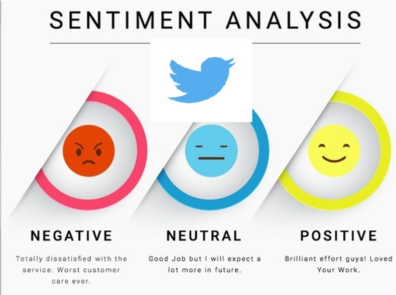
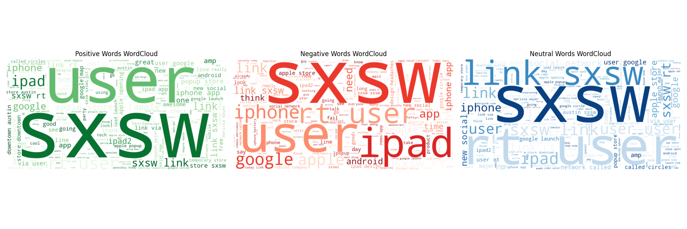
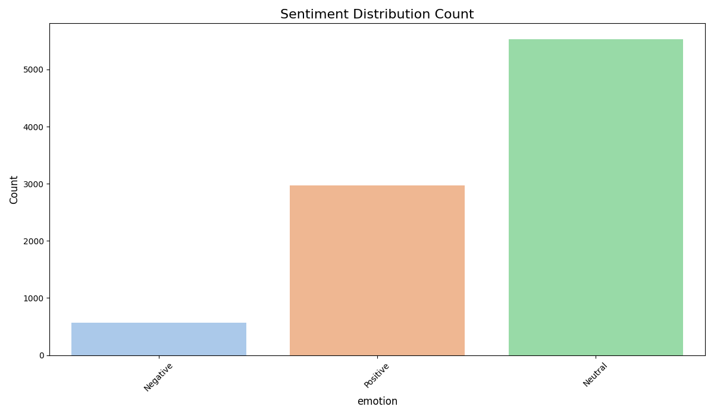
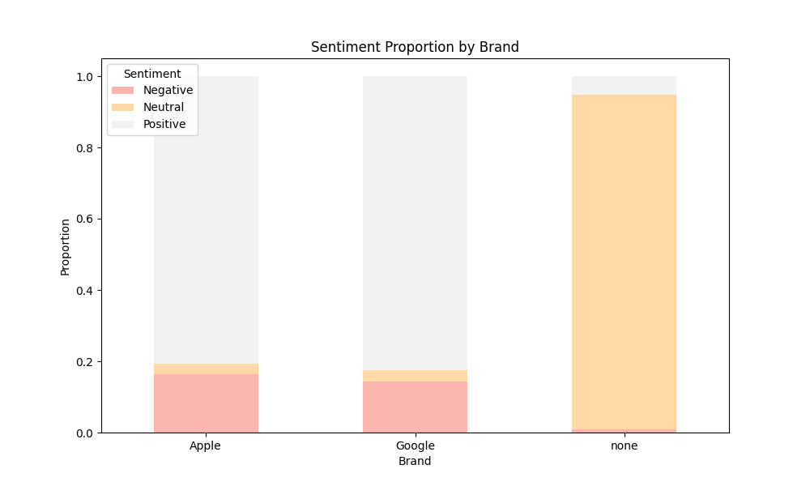
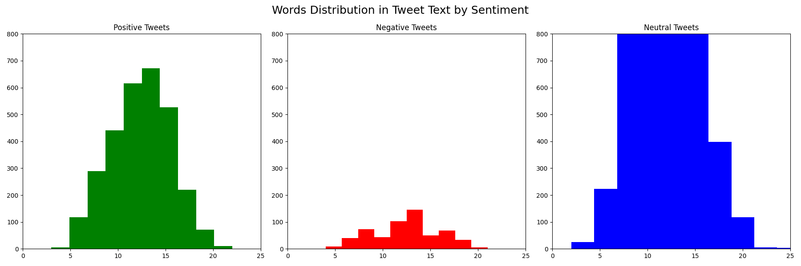

# **Twitter Sentiment Analysis: Apple vs. Google Products**

Authors: Edwin Korir, Maryan Daud and Sarah Njoroge

A Machine Learning Approach to Understanding Customer Sentiment

#### **Table of Contents**

1. Project Overview

2. Business Context

3. Key Objectives

4. Dataset

5. Data Preparation & Cleaning

6. Exploratory Data Analysis (EDA)

7. Modeling & Evaluation

8. Key Findings

9. Conclusion & Future Work

10. Libraries & Tools

## **1. Project Overview**

This project performs sentiment analysis on Twitter data related to Apple and Google products. The goal is to classify tweets into positive, negative, or neutral sentiments using Natural Language Processing (NLP) and machine learning models.

## Business Problem Statement

As a consulting firm, Twitter has assigned us the task of building a model that can rate the sentiment of a Tweet based on its content that can correctly categorize Twitter sentiment about Apple and Google products into positive, negative, or neutral categories and gain valuable insights into public perception, that will be used for informed decision-making in business strategies and customer satisfaction enterprise.

### **Objective**

The goal is to automate sentiment classification of tweets mentioning Apple and Google products using Natural Language Processing (NLP) and machine learning.

**Why Sentiment Analysis?**

* Brand Perception: Measures public opinion on products.

* Customer Feedback: Identifies pain points and praises.

* Competitive Analysis: Compares sentiment between Apple and Google.

* Real-Time Monitoring: Helps businesses react quickly to PR crises.

# **2. Business Context**

* Apple and Google are global tech giants with millions of users expressing opinions online.

* Manual sentiment tracking is inefficient due to high tweet volume.

* Automated sentiment classification enables real-time insights for:

### **Stakeholders**

 Stakeholder	Interest

* Twitter (Client)	Wants to offer sentiment analytics to brands.

* Apple & Google	Uses insights for product improvements.

* Marketing Teams	Measures campaign effectiveness.

* Product Managers	Tracks post-launch satisfaction.

### **Challenges**

* High volume of tweets makes manual analysis impossible.

* Noisy data (misspellings, slang, emojis).

* Imbalanced classes (more neutral tweets than positive/negative).

# **3. Key Objectives**

### **Binary Classification (Positive vs. Negative)**

#### **Model: Logistic Regression**

Why? Simple, interpretable, works well for binary tasks.

Target Accuracy: 85% → Achieved 90%.

### **Multiclass Classification (Positive/Negative/Neutral)**

#### **Model: XGBoost (optimized with GridSearchCV)**

Why? Handles imbalanced data, robust performance.

Target Accuracy: 70% → Achieved 71%.

### **Sentiment Trends (Apple vs. Google)**

Visualized using bar plots and word clouds.

Key Insight: Apple has more mentions, but Google has a higher positivity rate.

## **4. Dataset**
Source & Structure
9,093 tweets from CrowdFlower.

#### **Columns:**

* tweet_text (Text content)

* emotion_in_tweet_is_directed_at (Product/brand mentioned)

* is_there_an_emotion_directed_at_a_brand_or_product (Sentiment label) (Positive/Negative/Neutral)

### **Preprocessing Steps**

1. Handling Missing Values
  
* Dropped rows with missing tweet_text.

2.  Filled missing emotion_in_tweet_is_directed_at with "none".

3. Removing Duplicates

* 22 duplicate tweets removed to prevent bias.

4.  Sentiment Label Standardization

* Consolidated labels (e.g., "No emotion" → "Neutral").

5. Brand Mapping

* Apple: iPhone, iPad, Apple, iPad or iPhone App

* Google: Android, Google, Android App

* Grouped products under Apple or Google.

# **5. Exploratory Data Analysis (EDA)**

#### **1. Sentiment Distribution**

* Neutral (61%): Mostly informational tweets (e.g., "Just bought an iPhone.")

* Positive (33%) (e.g., "Love my new iPad!")

* Negative (6%) (e.g., "Google Maps crashed again.")

#### 2. **Brand-wise Sentiment Comparison**

* Apple: More tweets (27% of dataset), mixed sentiment.

* Google: Fewer tweets (6.7%), but higher % positive.

#### **3. words distribution in tweet by sentiment**

* Positive: more words
* Neutral the most words
* Negative: the least of words

## **6. Modeling & Evaluation**

### **1. Binary Classification (Logistic Regression)**

#### **Preprocessing:**

* Tokenization: Split tweets into words.

* Stopword Removal: Removed "the," "and," etc.

* Count Vectorization: Converted text to numerical features.

**Results:**

**Metric	Score**
* Accuracy	90%

* Precision (Positive)	88%

* Recall (Negative)	92%

#### **2. Multiclass Classification (XGBoost)**

Why XGBoost?

* Handles imbalanced data better than Logistic Regression.

* Optimized with GridSearchCV for hyperparameter tuning.

**Best Parameters:**

python
{
    'learning_rate': 0.3,
    'max_depth': 7,
    'n_estimators': 200
}

**Results:**

**Class	Precision	Recall**
* Positive	75%	80%

* Negative	70%	65%
* Neutral	85%	82%

## **7. Key Findings**

* Neutral tweets dominate (61%), suggesting most tweets are informational, not emotional.

* Apple gets more mentions (27%) than Google (6.7%).

* Google has a higher positivity rate (possibly due to fewer complaints).

* Logistic Regression outperforms XGBoost for binary classification (90% vs. 71%).

#### **Research Questions Answered**

* Can logistic regression accurately classify binary sentiments? Yes, with ~90% accuracy.

* Which multiclass model performs better?  XGBoost outperforms Naive Bayes.

* What are sentiment patterns for Apple vs. Google?  Apple tweets are more positive.

* Do tweets target specific brands?  Yes, especially Apple products like iPad and iPhone.

* Can insights guide brand strategy?  Yes, engagement and feedback systems are recommended.

 

## **8. Conclusion & Future Work**

### **Business Impact**

* Apple: Should monitor negative tweets for product issues.

* Google: Can leverage positive sentiment in marketing.

### **Future Improvements**

* Handle Class Imbalance

* Use SMOTE (Synthetic Minority Over-sampling).

* Improve XGBoost Performance

* Try BERT embeddings for better text representation.

* Real-Time Dashboard

* Deploy model on AWS/GCP for live sentiment tracking.

## **9. Libraries & Tools**
* Task	Tools

* Data Cleaning	Pandas, NumPy

* Text Processing	NLTK, SpaCy

* Feature Extraction	 CountVectorizer

* Modeling	Scikit-learn, XGBoost

* Visualization	Matplotlib, Seaborn, WordCloud

#### **How to Reproduce**

!. Clone the repository

**bash**

2. Install Dependencies:

**bash**

pip **install** pandas numpy nltk scikit-learn xgboost matplotlib seaborn wordcloud or pip **install** -r requirements

3. Run the Notebook:

**bash**

 jupyter notebook Twitter_sentiment_Analysis_Notebook.ipynb

### **Final Thoughts**

* This project demonstrates how NLP and machine learning can extract actionable insights from social media. Future work could integrate real-time APIs for live sentiment tracking.

 ## **Next Steps:**

* In future work, we aim to enhance model performance and adaptability by exploring the following strategies:

**1. Advanced Modeling Techniques**

* Incorporate attention mechanisms (e.g., with transformers or LSTM-attention models) to better capture context and sentiment nuances within tweets.

**2. Ensemble Methods**

* Apply ensemble learning (e.g., stacking, boosting, or bagging) to combine strengths of multiple models and improve overall prediction robustness.

**3. Domain-Specific Fine-Tuning**

* Fine-tune models on industry-specific datasets (e.g., tech product reviews or consumer electronics) to improve relevance and classification accuracy.

By addressing current limitations and applying these enhancements, we aim to build a more accurate and adaptable sentiment analysis solution for real-world applications.

* Deploy model as a Flask/Django web app.

* Expand to other brands (Samsung, Microsoft).

### For more information
Please review our full analysis in our **[Jupyter Notebook](Twitter_sentiment_Analysis_Notebook.ipynb)**
  or our presentation.

For any additional questions, please contact **[Edwin Korir]**,**[Maryan Daud]**,**[Sarah Njoroge]**

